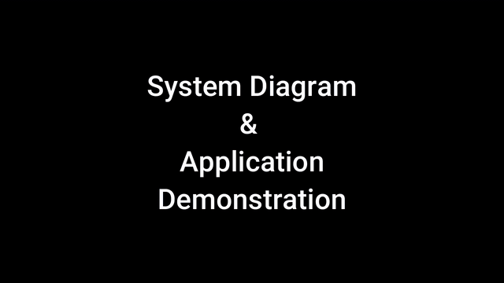
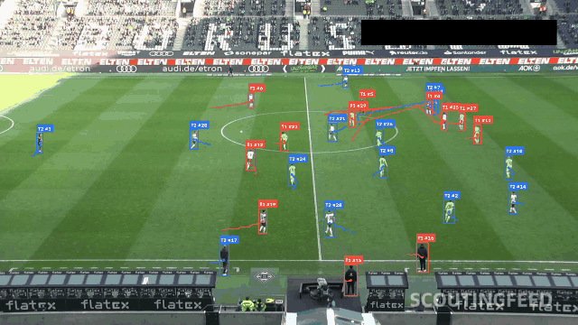

<!-- Animated Header -->

  

<h1 align="center">&#128075; Muhammad Hassan Mukhtar</h1>

  &#127891; MSc Artificial Intelligence &mdash; University of Salford  
  &#128205; Manchester, United Kingdom  
  &#128640; <b>AI Researcher | Data Engineer | Full Stack Developer</b>

  
  
  

  

AI research: MSc Artificial Intelligence thesis on secure and trust-aware active learning using clean baselines, stochastic and adversarial label noise, CNN-transformer hybrids, Vision Transformer models, infection rate, poisoned-sample uptake, robustness, and controlled comparison.

## Animations

<!-- GIF-GALLERY:START -->
<table>
  <tr>
    <td align="center" width="180"></td>
    <td align="center" width="180"></td>
    <td align="center" width="180"></td>
  </tr>
  <tr>
    <td align="center" width="180"></td>
    <td align="center" width="180"></td>
    <td align="center" width="180"></td>
  </tr>
  <tr>
    <td align="center" width="180"></td>
    <td align="center" width="180"></td>
    <td align="center" width="180"></td>
  </tr>
  <tr>
    <td align="center" width="180"></td>
    <td align="center" width="180"></td>
    <td align="center" width="180"></td>
  </tr>
</table>
<!-- GIF-GALLERY:END -->

Add new GIF files to `meta`. The README gallery is generated from that folder.
